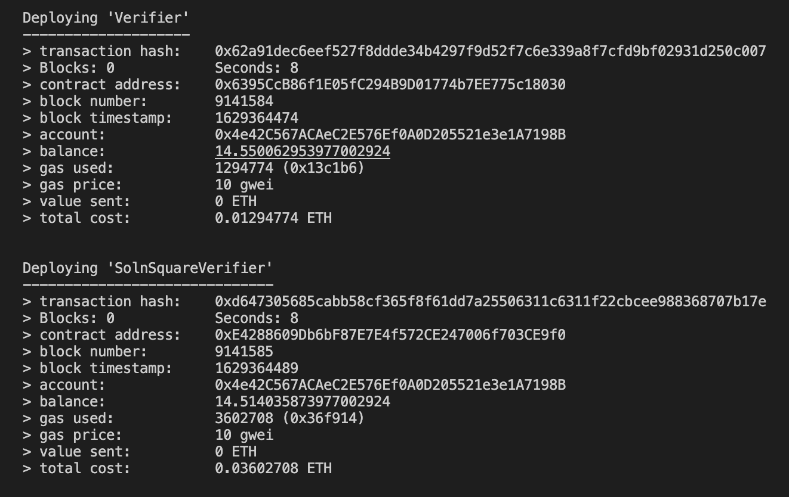

# Udacity Blockchain Capstone

Final project of the blockchain nanodegree program of Udacity. The goal was to create an ERC721 token with zkNARKs properties. 
The NFT represent properties that can be listed on OpenSea. 

# Tools Versions

- Node: v16.4.0
- Truffle: v5.4.0
- Solidity: 0.8.6

# Addresses On The Rinkeby Network

The contracts are deployed on the rinkeby network, as shown in the following image.

You can see the contracts here: 
* [Verifier](https://rinkeby.etherscan.io/address/0x6395CcB86f1E05fC294B9D01774b7EE775c18030)
* [SolnSquareVerifier](https://rinkeby.etherscan.io/address/0xE4288609Db6bF87E7E4f572CE247006f703CE9f0)

The ABIs are in `build/contracts`.

# OpenSea Market Places

* [Minter account](https://testnets.opensea.io/0x4e42c567acaec2e576ef0a0d205521e3e1a7198b)
* [Buyer account](https://testnets.opensea.io/0xc9a8b75556d15212c093bdb25fc0e34cf129e6fa)

# How To Use The Code

1. In a terminal, run `npm install`.
2. Run `ganache-cli`.
3. To test the contratcts, run `truffle test ./test/TestERC721Mintable.js`, `truffle test ./test/TestSolnSquareVerifier.js`, `truffle test ./test/TestSquareVerifier.js`.
4. To deploy on rinkeby, run `truffle migrate --network rinkeby`. 
5. In a terminal, run `npm run dapp`. This will open a simple web UI to mint token (`localhost:8000`). You have to connect on Metamask using the same mnemonic as the one you used to deploy the contracts. 

6. Just set a token id in the text box (int only) and click mint. If the current account is the one that deployed the contract, you will be able to mint. 
